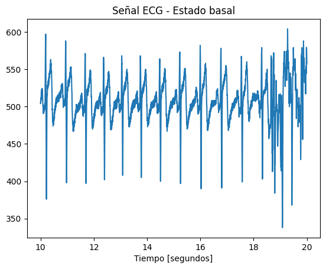

# **LABORATORIO 6: Segmentación de la señal ECG**

## Objetivos
---
- Escoger los segmentos de la señal obtenida que tengan menos ruido
- Crear un dataset con toda la información de la señal de ECG adquirida
***
## Introducción

### Señal del electrocardiograma
Para este laboratorio es importante recordar que este tipo de señal se caracteriza por cinco picos conocidos como puntos de referencia, que se representan con las letras P,Q,R, S y T[1]. 

- La onda P: Resultado de la despolarización de la aurícula y el ventrículo provoca el resto de picos.
- Intervalo PR: representa el tiempo desde el comienzo de la despolarización auricular hasta el comienzo de la despolarización ventricular e incluye el retraso en el nodo AV
- El complejo QRS es la despolarización de ambos ventrículos cardíacos, utilizado como punto de referencia para el análisis de señales.
- El intervalo QT es un indicador de la repolarizacíón ventricular
- El segmento ST representa el final de la despolarización ventricular y el comienzo de la repolarización ventricular
- La onda Q representa la despolarización del tabique interventricular.
- La onda R representa el estímulo eléctrico a medida que pasa por los ventrículos durante la despolarización.
- La onda S representa la despolarización final de las fibras de Purkinje.
- La onda T representa la repolarización ventricular[1][2]

<p align="center"> 

</p>
<p align="center"> 
Morfología de la señal ECG [1]
</p>

### Ruido de la señal ECG


### Fases consideradas para la elaboración del Dataset:
- Estado basal inicial
- Inhalación profunda de 3 a 5 segundos hasta encontrar varianza
- Estado basal posterior a la inhalación profunda
- Después de realizar ejercicio

***

## Ploteo de las 4 señales obtenidas

Debido a que la señal completa en cada fase presenta bastante ruido y lo que se desea en el Dataset es tener información que sirva, se procedió a escoger aproximadamente los 20 segundos que tuvieran la menor cantidad de ruido de cada una de las señales. 

Para poder segmentar cada una de las señales, se consideró el tamaño de las señales en muestras y el tamaño de una sola onda en muestras. La cantidad de filas en la matriz será la división entre estos dos valores, respectivamente. Asimismo, la cantidad de columnas de la matriz es el tamaño de una sola onda en muestras.

<p align="center"> 

</p>
<p align="center"> 
Método para segmentar la señal en forma de matriz. Elaboración propia.
</p>

### Señal ECG en Estado Basal 

| <!-- -->      | <!-- -->        |
|:-------------:|:---------------:|
| Señal Completa         |         |
| Señal durante los 20 segundos elegidos con menor ruido         |        |
| Señal de una sola onda         |       |

### Señal ECG durante Inhalación Profunda

| <!-- -->      | <!-- -->        |
|:-------------:|:---------------:|
| Señal Completa         |         |
| Señal durante los 20 segundos elegidos con menor ruido         |        |
| Señal de una sola onda         |       |


### Señal ECG en Estado Basal Post Inhalación

| <!-- -->      | <!-- -->        |
|:-------------:|:---------------:|
| Señal Completa         |         |
| Señal durante los 20 segundos elegidos con menor ruido         |        |
| Señal de una sola onda         |       |


### Señal ECG Post Ejercicio

| <!-- -->      | <!-- -->        |
|:-------------:|:---------------:|
| Señal Completa         |         |
| Señal durante los 20 segundos elegidos con menor ruido         |        |
| Señal de una sola onda         |       |


***
## Creación del Dataset en Python

### Link to GoogleColab
En el siguiente link, encontrará el código utilizado para la elaboración del Dataset de las señales con python. 
`<link>` : https://colab.research.google.com/drive/1S2x6B_OGGop9mRUyJigUtoExle4sktkw?usp=sharing
### Python code
```python

```

***

## Conclusiones

- El ECG es una herramienta esencial para la detección y el diagnóstico clínico de enfermedades cardíacas.
- La ubicación de los electrodos es importante para obtener una buena señal, ya que si ubicamos los electrodos en las muñecas se observan más ruido debido a que los músculos de brazo generan interferencia en la señal.

***

## Referencias

[1]  J. Aspuru et al., “Segmentation of the ECG Signal by Means of a Linear Regression Algorithm,” Sensors, vol. 19, no. 4, p. 775, Feb. 2019, doi: https://doi.org/10.3390/s19040775.

[2] Y. Sattar and L. Chhabra, “Electrocardiogram,” Nih.gov, Jan. 28, 2023. https://www.ncbi.nlm.nih.gov/books/NBK549803/ ‌

‌
***


