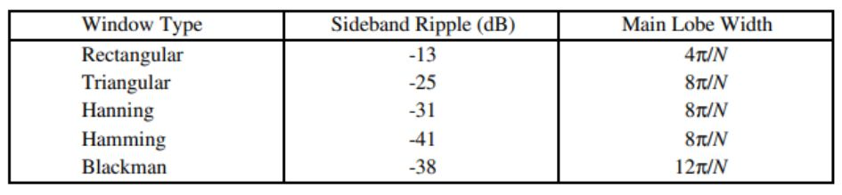
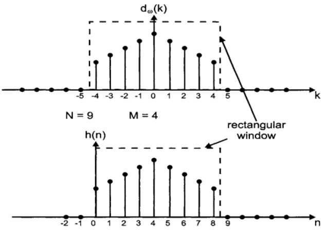
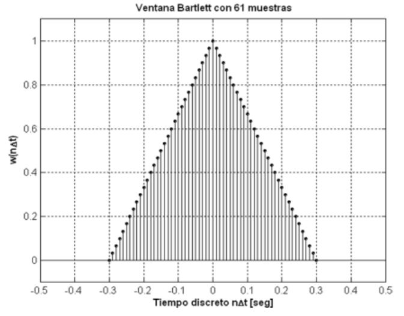
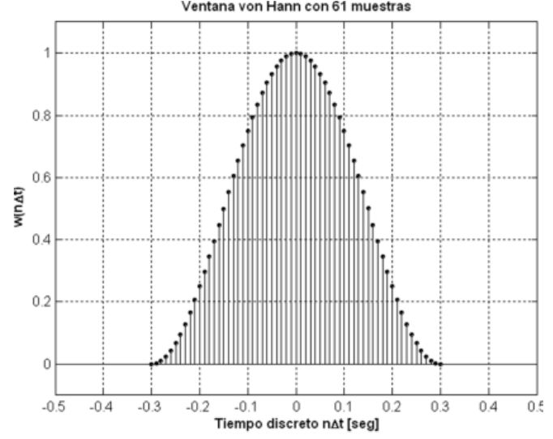
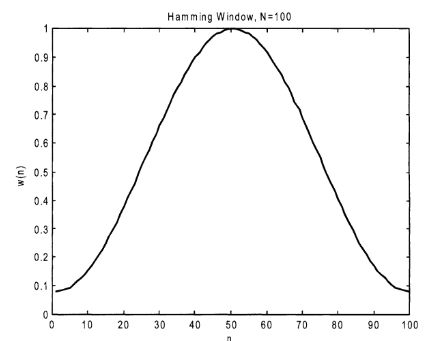
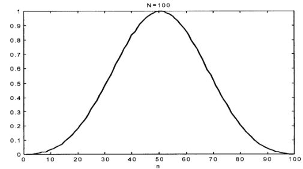

# **LABORATORIO 7: Filtros IIR y FIR**

## **Objetivos**

- Diseñar un IIR eligiendo si es Bessel, Butterworth, Chebyshev o Eliptico.
- Elegir 2 métodos de ventana para diseñar un filtro FIR
- Filtrar el Dataset de las señales ECG realizado en el laboratorio anterior.

***
## **Introducción**

### **¿Qué son los filtros?**
Un filtro es un sistema que realiza un proceso de discriminación de una señal de entrada obteniendo variaciones en su salida, esto depende de algunos parámetros.
Los filtros digitales tienen como entrada una señal analógica o una señal digital y su salida es otra señal analógica o digital pero con variaciones como en su amplitud, frecuencia o fase dependiendo de las características del filtro [1]. Asimismo, el uso de filtros digitales es muy amplio hoy en día debido a la fácil disponibilidad de las computadoras.

**Ventajas:**
* Un filtro digital es altamente inmune al ruido debido a la forma en que se implementa.
* La precisión depende únicamente del error de redondeo que está directamente determinado por el número de bits que el diseñador elige para representar las variables en el filtro.
* Es fácil y económico cambiar las características operativas de un filtro.
* El rendimiento no depende de factores como el envejecimiento de los componentes, la variación de temperatura y tensión de alimentación, esto es muy importante en aplicaciones médicas, ya que la mayoría de señales tienen frecuencias bajas que pueden distorsionarse [2].

### **Filtros IIR**

 

   
Fig 1. Esquema de funcionamiento de un filtro IIR.

Es un tipo de filtro digital que establece que la respuesta a una entrada impulso (delta de Kronecker) existe indefinidamente con un número infinito de valores no nulos, por lo que nunca vuelve al reposo y se caracterizan por tener una retroalimentación de la señal de salida [3]. Debido a su diseño de retroalimentación, los filtros IIR pueden ser más eficientes en términos de uso de recursos computacionales en comparación con los filtros FIR. Los filtros IIR se utilizan comúnmente en aplicaciones de procesamiento de señales, como la eliminación de ruido, la ecualización de audio y la implementación de efectos de audio.

* **Bessel:** Este tipo de filtro tiene una respuesta de fase lineal, lo que significa que todas las frecuencias de la señal de entrada se retrasan por el mismo tiempo. Esto hace que sea útil en aplicaciones donde la distorsión de la fase es crítica, como en la señalización de datos o en la transmisión de señales de audio y vídeo [4].

 

   
Fig 2. Filtro Bessel.

* **Butterworth:** Tiene una respuesta de amplitud plana en la banda pasante y una caída uniforme en la banda de rechazo. Esto significa que atenúa las frecuencias no deseadas de manera uniforme en toda la banda de rechazo. El filtro Butterworth se utiliza comúnmente en aplicaciones de audio y en la eliminación de ruido de señales de baja frecuencia [4]. Además, tienen como característica una atenuación de 3dB en el punto de corte. 

 

   
Fig 3. Filtro Butterworth.

* **Chevyshev:** Tiene una respuesta de amplitud de paso de banda irregular. Es capaz de proporcionar una atenuación más pronunciada en la banda de rechazo que el filtro Butterworth, a costa de una mayor irregularidad en la banda de paso. Esto lo hace útil en aplicaciones donde se requiere una mayor atenuación en la banda de rechazo, como en la eliminación de interferencias de radiofrecuencia [4].

 

   
Fig 4. Filtro Chevyshev.

* **Elíptico:** También conocido como filtro de Cauer, tiene una respuesta de amplitud de paso de banda y una banda de rechazo muy selectiva. Es útil en aplicaciones donde se requiere una alta selectividad en la banda de rechazo y en la banda de paso, como en la eliminación de interferencias de radiofrecuencia en sistemas de telecomunicaciones y en la separación de señales en el procesamiento de señales biomédicas [4].

 

   
Fig 5. Filtro de Cauer (elíptico).

### **Filtros FIR**

 

   
Fig 6. Esquema de funcionamiento de un filtro FIR.
<<<<<<< HEAD

Un filtro de respuesta de impulso finito posee un número limitado de términos. Este tipo de filtro es causal, lo que significa que solo depende de entradas presentes y pasadas. Entre otras de sus propiedades tenemos que es lineal, es decir, tiene un retardo de tiempo puro como respuesta de fase, y que es estable, por lo que siempre que la entrada del filtro esté acotada, la salida de este también lo estará. Estas propiedades ayudan al diseño de filtros FIR para que cumplan con ciertas especificaciones necesarias.[ ] Uno de los métodos de diseño de filtros FIR es el uso de ventanas. Este se basa en acortar la respuesta en impulsos de la señal, mediante la multiplicación de la señal con la ventana [a]. Existen diferentes tipos de ventanas, entre las más conocidas tenemos:

* Rectangular
* Barlett
* Hanning
* Hamming
* Blackman

 

   
Fig x. Ventanas de un filtro FIR.

Un filtro de respuesta de impulso finito posee un número limitado de términos. Este tipo de filtro es causal, lo que significa que solo depende de entradas presentes y pasadas. Entre otras de sus propiedades tenemos que es lineal, es decir, tiene un retardo de tiempo puro como respuesta de fase, y que es estable, por lo que siempre que la entrada del filtro esté acotada, la salida de este también lo estará. Estas propiedades ayudan al diseño de filtros FIR para que cumplan con ciertas especificaciones necesarias. [2] Uno de los métodos de diseño de filtros FIR es el uso de ventanas. Este se basa en acortar la respuesta en impulsos de la señal, mediante la multiplicación de la señal con la ventana [5]. Existen diferentes tipos de ventanas, entre las más conocidas tenemos [7]:

* **Rectangular:** Este tipo de ventana mantiene la respuesta del impulso pero dentro de cierto intervalo. 

 

   
Fig 7. Ventana rectangular.

* **Bartlett:** Es una ventana triangular simétrica.

 

   
Fig 8. Ventana Barlett.

* **Hanning:** Es similar a la ventana Hamming pero es más estrecha.

 

   
Fig 9. Ventana Hanning.

* **Hamming:** Esta ventana es ligeramente más estrecha a los lados, lo que reduce el ruido lateral. Sin embargo, no llega a estrecharse hasta 0.  

 

   
Fig 10. Ventana Hamming.

* **Blackman:** Es aproximadamente 50% más ancha que la ventana Hamming, lo que la vuelve más precisa. 

 

   
Fig 11. Ventana Blackman.

## **Tabla resumen**
### **Filtros IIR**
El filtro IIR utilizado fue el Butterworth debido a que tiene una respuesta en frecuencia plana en la banda de paso, lo que significa que atenúa las frecuencias no deseadas sin distorsionar la señal de interés en esa banda. Además, tiene una transición suave entre la banda de paso y la banda de rechazo, lo que significa que la atenuación de las frecuencias no deseadas disminuye gradualmente, logrando así obtener una alta precisión en el resultado y conservar la calidad de la seña [8]

### **Filtros FIR**
Para el filtro FIR hemos utilizado el método de enventanado Hamming y el enventanado Blackman. Elegimos estas dos ventanas debido a que son las más utilizadas en el diseño de filtros en la actualidad [6]. En los resultados se puede notar que la ventana Blackman tiene una mejor atenuación. Esto se debe a que muestra una ondulación máxima de la banda suprimida más baja y es más ancha de la ventana Hamming, es decir, tiene una mejor reducción de las frecuencias laterales [7].

| Aplicando Ventana Hamming  | Aplicando Ventana Blackman  | Comparación de filtros  |
|:-------------: |:---------------:|:---------------:|
|          |           |           |

>>>>>>> 816e523bcaf2e746b6eacb045320e74427cb8375
### **Tabla**

| Campo  | Señal Cruda  | Filtro IIR | Filtro FIR |
|:-------------: |:---------------:| :-------------:| :-------------: |
| Basal        |   |        |  |
| Inhalación Profunda        |           |        |  |
| Basal Post Inhalación        |           |         |  |
| Post Ejercicio        |        |       |     |

***
## **Código en Python**

### Link to GoogleColab
En el siguiente link, encontrará el código utilizado para la elaboración del Dataset de las señales con python. 
`<link>` : https://colab.research.google.com/drive/1S2x6B_OGGop9mRUyJigUtoExle4sktkw?usp=sharing

En el siguiente link, encontrará el código de creación del filtro IIR: 
`<link>` :https://colab.research.google.com/drive/1Ay7C6EOnX2YCfnBWgcl2Tf0kGtFe8TQU?usp=sharing

En el siguiente link, encontrará el código de creación del filtro FIR: 
`<link>` :https://colab.research.google.com/drive/1maBdqDRp9A2xr-nYYRZwZFxFh0PJ0FT8?usp=sharing

***

## Conclusiones

- La mejor opción de filtro FIR para las señales ECG de nuestro Dataset fue el método de ventana Blackman, pues esta presenta una mejor caída.
- El filtro Butterworth es una buena opción si se desea tener una respuesta de frecuencia suave y monótonamente decreciente.

***

## Referencias
[1] J. Cedillo et al., “IMPLEMENTATION OF DIGITAL FILTERS OF FIR TYPE IN FPGA Implementación de Filtros Digitales Tipo FIR en FPGA,” vol. 37, 2008, Available: https://www.scielo.org.mx/pdf/poli/n37/n37a12.pdf

‌[2] Willis J. Tompkins. Biomedical digital signal procesing.Prentice Hall, may, 1993. 

[3] I. Grout, “Introduction to Digital Signal Processing,” Digital Systems Design with FPGAs and CPLDs, pp. 475–536, 2008, doi: https://doi.org/10.1016/b978-0-7506-8397-5.00007-6.

‌[4] D. Filtros, L. Martínez, A. Gómez, J. Serrano, J. Vila, and Gómez, “2.1,” 2009. Available: http://ocw.uv.es/ingenieria-y-arquitectura/filtros-digitales/tema_2._revision_de_los_tipos_de_filtros_analogicos_mas_comunes.pdf

‌[5] D. Filtros, L. Martínez, A. Gómez, J. Serrano, J. Vila, and Gómez, “3.1,” 2009. Available: http://ocw.uv.es/ingenieria-y-arquitectura/filtros-digitales/tema_3._diseno_de_filtros_fir.pdf

[6] D. Dumitrescu and Costin-Anton Boiangiu, “A Study of Image Upsampling and Downsampling Filters,” Computers, vol. 8, no. 2, pp. 30–30, Apr. 2019, doi: https://doi.org/10.3390/computers8020030.
‌
[7] E. Lai, “6 - Finite impulse response filter design,” ScienceDirect, Jan. 01, 2003. https://www.sciencedirect.com/science/article/abs/pii/B9780750657983500060 (accessed May 04, 2023).

[8] “Diseño y aplicaciones del circuito de filtro Butterworth de paso bajo - Electronica Lugo,” Electronica Lugo, Jun. 02, 2018. https://electronicalugo.com/diseno-y-aplicaciones-del-circuito-de-filtro-butterworth-de-paso-bajo/ (accessed May 04, 2023).

***

