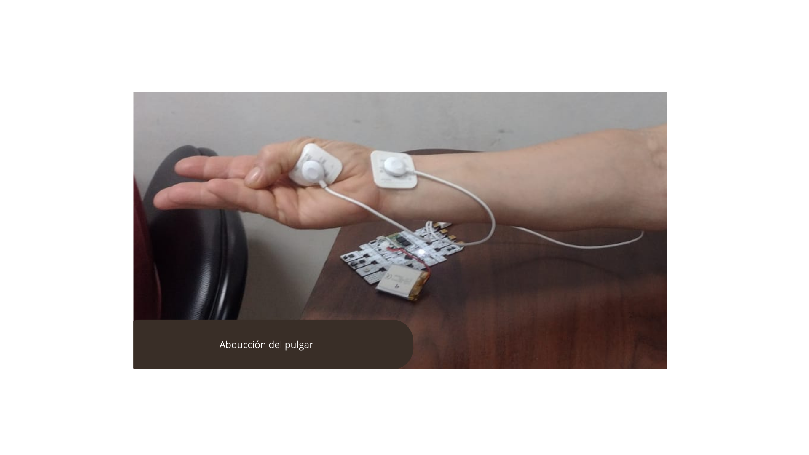

# Introducción a Señales Biomédicas
## **Early diagnosis of carpal tunnel syndrome using electromyogram signals**  

## **Diagnóstico temprano del síndrome del túnel carpiano mediante señales de electromiograma** 

Bienvenidos al repositorio del **equipo 9**

Somos estudiantes de la carrera de Ingeniería Biomédica PUCP-UPCH 2023-1.
El proyecto abordará los temas de adquisición y procesamiento de señales electromiográficas. Se verá contenido teórico y práctico para conocer los procesos tecnológicos que se utilizan para el manejo de señales.

**Señal de interés:** Electrocardiograma (ECG)

<h2 align="justify"> 
Tabla de contenidos:
</h2>

- [Resumen](#resumen)
- [Motivación](#motivación)
- [Principales hallazgos](#principales-hallazgos)
- [Links importantes](#links-importantes)
- [Docentes del curso](#docentes-del-curso)
---

### Resumen

 
La presente investigación propone utilizar señales electromiográficas para el diagnóstico del túnel carpiano con el objetivo de ayudar a disminuir el número de falsos positivos y negativos que se obtienen con los criterios actualmente utilizados. Para ello se analizaron las señales EMG mediante el kit Bitalino de un paciente con túnel carpiano y un paciente control. Las señales fueron filtradas y analizadas utilizando el lenguaje Python. De esto se obtuvo que las señales presentaron ligeras diferencias en la actividad eléctrica de ambos pacientes, se observó una disminución en el patrón de interferencia lo que indica una reducción en la actividad eléctrica registrada en el músculo durante la contracción y se concluye que el túnel carpiano el paciente tiene una disminución progresiva en la velocidad de conducción nerviosa en comparación con un paciente de control.

---

### Motivación

 

El síndrome del túnel carpiano es un problema neurológico frecuente que se presenta cuando el nervio mediano se comprime o se aprieta en la zona de la muñeca [1]. 

Se estima que esta enfermedad afecta a aproximadamente un 4% a 5% de la población mundial [2]. Se ha encontrado que la proporción de pacientes con síndrome de túnel carpiano aumenta con la edad, obteniendo el mayor número de incidencia en hombres de 40 años y mujeres de 50 años [3]. 

La fisiopatología de este síndrome resulta de una combinación de mecanismos de compresión y tracción y puede estar vinculado a factores laborales, con la exposición a altos niveles de vibración en las manos y brazos, trabajo prolongado con una muñeca en posición flexionada o extendida, altos requerimientos de fuerza manual y alta repetitividad en las tareas laborales [4].

El problema identificado es que no existe un patrón determinado para diagnosticar a pacientes con túnel carpiano. Por ello, en esta investigación se propone utilizar señales electromiográficas para el diagnóstico de túnel carpiano con el objetivo de ayudar a reducir la cantidad de falsos positivos y negativos que se obtienen con los criterios usados actualmente como los síntomas y signos clínicos. 

---
     

### Principales hallazgos

   
Para analizar el estado de la enfermedad se realizaron pruebas basadas en movimientos activos de la muñeca (flexión, extensión, desviación radial, desviación ulnar, pronación, supinación) [5] y fuerza de abducción del pulgar [6] mientras que se mide la señal electromiográfica de los músculos involucrados. Estas pruebas servirán para la reconocer los patrones de las señales EMG de las participantes, quienes fueron señoras con las edades de 46 y 52 años. 

Se adquirireron las señales con el Kit BiTalino y el software Open Signals.
Una vez importadas las señales se realizó el filtrado de cada una de ellas mediante el uso de un filtro pasa banda y un  filtro Notch.

*Figura 1. Movimientos activos de la muñeca* 

*Figura 2. Abducción del pulgar* 

*Figura 3. Señales EMG de la paciente control sin filtrado* 

*Figura 4. Señales EMG filtradas de la paciente control.* 

*Figura 5. Señales EMG de la paciente control síndrome de túnel carpiano* 

*Figura 6. Señales EMG filtradas de la paciente control síndrome de túnel carpiano* 

A partir de los valores máximos y mínimos que se obtuvieron para cada movimiento realizado se observó que la paciente control tenía valores más altos, lo cual indica que tiene valores de amplitud mayores. 
Por otro lado, de los valores RMS (Root Mean Square) obtenidos en 5 de los 7 movimientos que se  realizaron, la paciente con tunel carpiano presentó valores de RMS menores al control, esta disminución en el RMS indica un menor reclutamiento de la unidades motoras durante la contracción. Asimismo, los dos valores de RMS en el que el paciente con tunel carpiano salieron mayor se puede deber a que la paciente tuvo un mayor tiempo de descanso.

Se concluye que existe una diferencia en las señales registradas durante contracciones musculares entre la paciente control y una con síndrome del túnel carpiano, se observa una disminución en el patrón de interferencia, lo cual indica una reducción en la actividad eléctrica registrada en el músculo durante la contracción. Asimismo, la disminución en el patrón de interferencia y el valor de contracción voluntaria máxima reducido en la paciente con síndrome del túnel carpiano podría indicar una menor fuerza muscular. Por otro lado, se observa una disminución progresiva en la velocidad de conducción nerviosa y en la amplitud de las señales entre la paciente con síndrome del túnel carpiano y la paciente de control. 

   

---
     
### Links importantes
* Informe: https://docs.google.com/document/d/1-lfR3EVbEm9OArWXMdRQ86HtOIjvKhQNFDnVqe9sTD8/edit?usp=sharing
* Sobre el equipo: https://github.com/RosauraAstete/Equipo9.github.io/blob/main/ISB/README1.md

---

[1] “Carpal Tunnel Syndrome,” National Institute of Neurological Disorders and Stroke, 2023. https://www.ninds.nih.gov/health-information/disorders/carpal-tunnel-syndrome 

[2] J. O. Sevy and M. Varacallo, “Carpal Tunnel Syndrome,” Nih.gov, Sep. 05, 2022. https://www.ncbi.nlm.nih.gov/books/NBK448179/ 

[3] T. Yesuf, H. Aragie, and Y. Asmare, “Prevalence of Carpal Tunnel Syndrome and its associated factors

[4] J. O. Sevy and M. Varacallo, “Carpal Tunnel Syndrome,” Nih.gov, Sep. 05, 2022. https://www.ncbi.nlm.nih.gov/books/NBK448179/ 

[5] A. Rainoldi, M. Gazzoni, and R. Casale, “Surface EMG signal alterations in Carpal Tunnel syndrome: a pilot study,” European Journal of Applied Physiology, vol. 103, no. 2, pp. 233–242, Feb. 2008, doi: https://doi.org/10.1007/s00421-008-0694-x.

[6] C.-B. Kim, C.-H. Park, C.-H. Kim, H.-S. Lee, and M.-O. Kim, “Changes in Surface Electromyography Signal according to Severity in Patients with Carpal Tunnel Syndrome,” Journal of Electrodiagnosis and Neuromuscular Diseases, vol. 22, no. 1, pp. 15–22, Jun. 2020, doi: https://doi.org/10.18214/jend.2020.22.1.15.

